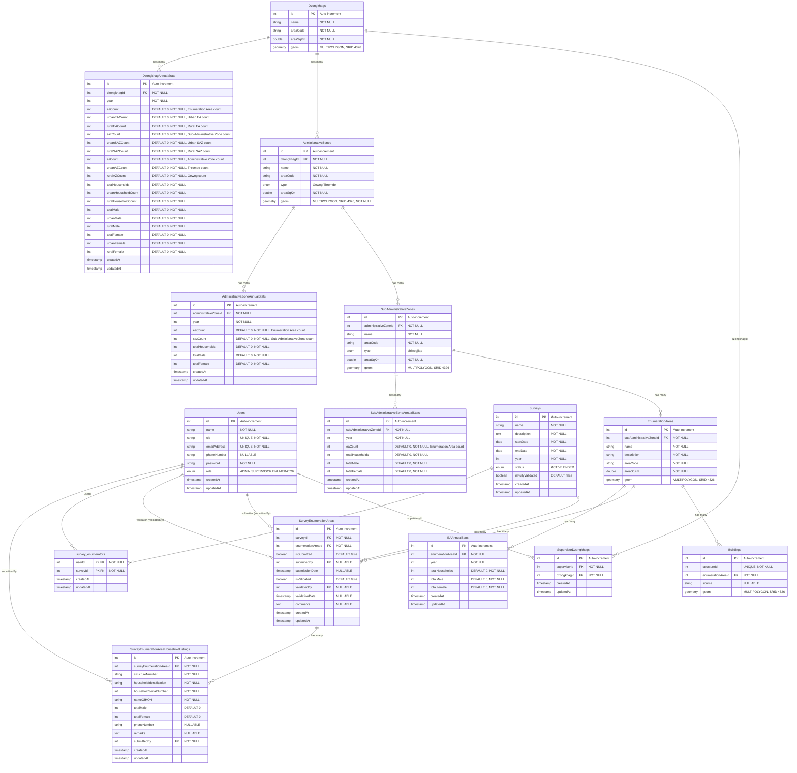

# NSFD Backend - Complete Entity Relationship Diagram (ERD)

## Overview

This ERD represents the complete database schema for the National Statistical Field Database (NSFD) Backend system, covering geographic hierarchies, user management, survey operations, and household data collection.

---

## Database Schema Diagram



---

## Table Descriptions

### 1. **Users**
**Purpose:** Central user management table for authentication and authorization.

**Roles:**
- `ADMIN`: Full system access, manages users and validates data
- `SUPERVISOR`: Manages dzongkhags, oversees enumerators, submits survey data
- `ENUMERATOR`: Collects household data in assigned enumeration areas

**Key Relationships:**
- Many-to-Many with `Dzongkhags` (via `SupervisorDzongkhags`) - Supervisors assigned to dzongkhags
- Many-to-Many with `Surveys` (via `survey_enumerators`) - Enumerators assigned to surveys
- One-to-Many with `SurveyEnumerationAreas` - Tracks who submitted/validated data
- One-to-Many with `SurveyEnumerationAreaHouseholdListings` - Tracks household data submitters

---

### 2. **SupervisorDzongkhags**
**Purpose:** Junction table managing supervisor-dzongkhag assignments.

**Business Logic:**
- A supervisor can manage multiple dzongkhags
- A dzongkhag can have multiple supervisors
- Used to filter surveys and enumeration areas by supervisor access

---

### 3. **Dzongkhags**
**Purpose:** Top-level administrative division in Bhutan (20 dzongkhags).

**Features:**
- Contains geographic boundary data (MULTIPOLYGON geometry)
- Area measurements in square kilometers
- Unique area codes for identification

**Hierarchy Position:** Level 1 (Root)

---

### 4. **AdministrativeZones**
**Purpose:** Second-level administrative division (Gewogs and Thromdes).

**Types:**
- `Gewog`: Rural administrative block
- `Thromde`: Urban municipality/town

**Features:**
- Must belong to a dzongkhag
- Contains geographic boundaries
- Area measurements and unique codes

**Hierarchy Position:** Level 2

---

### 5. **SubAdministrativeZones**
**Purpose:** Third-level administrative division (Chiwogs and Laps).

**Types:**
- `chiwog`: Rural village cluster (under Gewog)
- `lap`: Urban ward (under Thromde)

**Features:**
- Must belong to an administrative zone
- Contains geographic boundaries
- Area measurements and unique codes

**Hierarchy Position:** Level 3

---

### 6. **EnumerationAreas**
**Purpose:** Smallest geographic unit for census/survey data collection.

**Features:**
- Fundamental unit for household listings
- Contains geographic boundaries
- Unique area codes following hierarchical pattern
- Can be assigned to multiple surveys

**Hierarchy Position:** Level 4 (Leaf)

---

### 7. **Buildings**
**Purpose:** Physical structures within enumeration areas.

**Features:**
- Each building has a unique structure ID
- Linked to specific enumeration area
- Contains geometric footprint (MULTIPOLYGON)
- Source field tracks data origin

**Use Case:** Building-level spatial analysis and household location mapping

---

### 8. **EAAnnualStats**
**Purpose:** Store annual aggregated statistics for each Enumeration Area.

**Features:**
- Year-based statistical records
- Aggregated household and population counts (male/female)
- Unique constraint on `(enumerationAreaId, year)` - one record per EA per year
- Computed from validated survey data
- Supports historical trend analysis

**Key Fields:**
- `totalHouseholds`: Number of households in the EA for the year
- `totalMale`: Total male population
- `totalFemale`: Total female population

**Indexes:**
- Composite index on `(year, enumerationAreaId)` for fast year-based queries
- Single index on `enumerationAreaId` for EA-specific lookups

**Use Case:** 
- Annual reporting and statistics at EA level
- Year-over-year population trend analysis
- Demographic studies at EA level
- Historical data visualization
- Base data for hierarchical aggregation

---

### 9. **SubAdministrativeZoneAnnualStats (SAZAnnualStats)**
**Purpose:** Store annual aggregated statistics for each Sub-Administrative Zone (Chiwog/Lap).

**Features:**
- Aggregated from EAAnnualStats for all EAs within the SAZ
- Year-based statistical records
- Unique constraint on `(subAdministrativeZoneId, year)` - one record per SAZ per year
- Automatically computed via cron job (every minute)
- Pre-aggregated for fast dashboard access
- Upsert pattern: updates existing records or creates new ones

**Key Fields:**
- `eaCount`: Count of Enumeration Areas within the SAZ
- `totalHouseholds`: Sum of households from all EAs in SAZ
- `totalMale`: Sum of male population from all EAs
- `totalFemale`: Sum of female population from all EAs

**Indexes:**
- Composite index on `(year, subAdministrativeZoneId)`
- Single index on `subAdministrativeZoneId`

**Use Case:**
- Chiwog/Lap level reporting
- Rural/urban ward statistics
- Intermediate aggregation for higher levels

---

### 10. **AdministrativeZoneAnnualStats (AZAnnualStats)**
**Purpose:** Store annual aggregated statistics for each Administrative Zone (Gewog/Thromde).

**Features:**
- Aggregated from SAZAnnualStats for all SAZs within the AZ
- Year-based statistical records
- Unique constraint on `(administrativeZoneId, year)` - one record per AZ per year
- Automatically computed via cron job (every minute)
- Pre-aggregated for fast dashboard access
- Upsert pattern: updates existing records or creates new ones

**Key Fields:**
- `eaCount`: Count of Enumeration Areas within the AZ
- `sazCount`: Count of Sub-Administrative Zones within the AZ
- `totalHouseholds`: Sum of households from all SAZs in AZ
- `totalMale`: Sum of male population from all SAZs
- `totalFemale`: Sum of female population from all SAZs

**Indexes:**
- Composite index on `(year, administrativeZoneId)`
- Single index on `administrativeZoneId`

**Use Case:**
- Gewog/Thromde level reporting
- Administrative zone comparisons
- Intermediate aggregation for Dzongkhag level

---

### 11. **DzongkhagAnnualStats**
**Purpose:** Store annual aggregated statistics for each Dzongkhag (District) with urban/rural segregation.

**Features:**
- Aggregated from AZAnnualStats for all AZs within the Dzongkhag
- Year-based statistical records
- **Urban/Rural Segregation:** Statistics broken down by AZ type (Thromde=urban, Gewog=rural)
- Unique constraint on `(dzongkhagId, year)` - one record per Dzongkhag per year
- Automatically computed via cron job (every minute)
- Pre-aggregated for fast dashboard access
- Top-level aggregation for national statistics
- Upsert pattern: updates existing records or creates new ones

**Key Fields:**
- **EA Counts:**
  - `eaCount`: Total Enumeration Areas in Dzongkhag
  - `urbanEACount`: EAs under Thromde (urban municipalities)
  - `ruralEACount`: EAs under Gewog (rural blocks)
  
- **SAZ Counts:**
  - `sazCount`: Total Sub-Administrative Zones
  - `urbanSAZCount`: Laps (urban wards) under Thromdes
  - `ruralSAZCount`: Chiwogs (rural villages) under Gewogs
  
- **AZ Counts:**
  - `azCount`: Total Administrative Zones
  - `urbanAZCount`: Thromde (urban municipality) count
  - `ruralAZCount`: Gewog (rural block) count

- **Household Counts:**
  - `totalHouseholds`: Total households in Dzongkhag
  - `urbanHouseholdCount`: Households in urban areas (Thromdes)
  - `ruralHouseholdCount`: Households in rural areas (Gewogs)

- **Population (Male):**
  - `totalMale`: Total male population
  - `urbanMale`: Male population in urban areas
  - `ruralMale`: Male population in rural areas

- **Population (Female):**
  - `totalFemale`: Total female population
  - `urbanFemale`: Female population in urban areas
  - `ruralFemale`: Female population in rural areas

**Urban/Rural Logic:**
- **Urban:** Administrative Zone type = `THROMDE` → Urban SAZs (Laps) → Urban EAs → Urban households/population
- **Rural:** Administrative Zone type = `GEWOG` → Rural SAZs (Chiwogs) → Rural EAs → Rural households/population

**Indexes:**
- Composite index on `(year, dzongkhagId)`
- Single index on `dzongkhagId`

**Aggregation Flow:**
1. Get all Dzongkhags
2. For each Dzongkhag, get all Administrative Zones
3. For each AZ, determine urban/rural based on AZ type
4. Aggregate SAZ counts, EA counts, households, and population
5. Segregate totals into urban/rural categories
6. Upsert aggregated data

**Use Case:**
- District-level reporting with urban/rural breakdown
- National dashboard displays
- Provincial comparisons
- Public homepage statistics
- Urban vs rural demographic analysis
- Policy planning and resource allocation

---

### 12. **Surveys**
**Purpose:** Survey/census operations management.

**Statuses:**
- `ACTIVE`: Survey in progress, data collection ongoing
- `ENDED`: Survey completed, no new data entry

**Features:**
- Time-bound operations (start/end dates)
- Year-based organization
- Validation tracking flag (`isFullyValidated`)
- Many-to-Many relationship with enumeration areas

---

### 13. **SurveyEnumerationAreas**
**Purpose:** Junction table connecting surveys to enumeration areas with workflow tracking.

**Workflow States:**
1. **Not Submitted** (`isSubmitted = false`)
   - Initial state
   - Enumerators collecting data

2. **Submitted** (`isSubmitted = true, submittedBy = user`)
   - Data collection complete
   - Awaiting validation
   - Submission timestamp recorded

3. **Validated** (`isValidated = true, validatedBy = user`)
   - Admin has reviewed and approved data
   - Validation timestamp recorded
   - Final state

**Features:**
- Composite unique constraint on `(surveyId, enumerationAreaId)`
- Audit trail with submitter/validator user references
- Comments field for rejection notes or feedback
- Multiple indexes for performance optimization

---

### 10. **survey_enumerators**
**Purpose:** Junction table assigning enumerators to surveys.

**Business Logic:**
- An enumerator can work on multiple surveys
- A survey can have multiple enumerators
- Composite primary key `(userId, surveyId)` ensures unique assignments
- Prevents duplicate assignments

---

### 11. **SurveyEnumerationAreaHouseholdListings**
**Purpose:** Individual household records collected during surveys.

**Key Fields:**
- `structureNumber`: Building/structure identifier
- `householdIdentification`: Unique household ID within EA
- `householdSerialNumber`: Sequential number within survey-EA
- `nameOfHOH`: Name of Head of Household
- `totalMale/totalFemale`: Demographic counts
- `phoneNumber`: Contact information
- `remarks`: Additional notes

**Unique Constraint:**
- `(surveyEnumerationAreaId, householdSerialNumber)` ensures no duplicate household numbers within same survey-EA

**Indexes:**
- `surveyEnumerationAreaId`: Fast household retrieval per EA
- `structureNumber`: Link to building data
- `householdIdentification`: Quick household lookups

---

## Complete Relationship Summary

### Geographic Hierarchy (1:N)
```
Dzongkhag (1) → (N) AdministrativeZone
         ↓                ↓
  DzongkhagAnnualStats   AdministrativeZoneAnnualStats
         ↓
AdministrativeZone (1) → (N) SubAdministrativeZone
         ↓                         ↓
  AdministrativeZoneAnnualStats   SubAdministrativeZoneAnnualStats
         ↓
SubAdministrativeZone (1) → (N) EnumerationArea
         ↓                         ↓
  SubAdministrativeZoneAnnualStats   EAAnnualStats
         ↓
EnumerationArea (1) → (N) Building
         ↓
EnumerationArea (1) → (N) EAAnnualStats (one per year)
```

### User Access Patterns

**Supervisors:**
```
User (Supervisor) ←→ SupervisorDzongkhag ←→ Dzongkhag
                 ↓
         (Access to all EAs within assigned dzongkhags)
```

**Enumerators:**
```
User (Enumerator) ←→ survey_enumerators ←→ Survey
                 ↓
         (Access to assigned survey enumeration areas)
```

**Admins:**
```
User (Admin) → Full system access
         ↓
    (Can validate all survey data)
```

### Survey Data Flow

**1. Survey Setup:**
```
Survey → SurveyEnumerationAreas → EnumerationAreas
```

**2. Enumerator Assignment:**
```
Survey → survey_enumerators → Users (Enumerators)
```

**3. Data Collection:**
```
SurveyEnumerationArea (1) → (N) SurveyEnumerationAreaHouseholdListing
         ↓
    (Enumerator submits household data)
```

**4. Workflow Progression:**
```
SurveyEnumerationArea
    ↓
[Not Submitted] → isSubmitted=false, submittedBy=NULL
    ↓ (Enumerator completes)
[Submitted] → isSubmitted=true, submittedBy=enumeratorId
    ↓ (Admin reviews)
[Validated] → isValidated=true, validatedBy=adminId
```

---

## Key Indexes

### Performance Optimization

**SurveyEnumerationAreas:**
- `unique_survey_ea`: Unique `(surveyId, enumerationAreaId)`
- `idx_survey`: Fast survey-based queries
- `idx_enumeration_area`: Fast EA-based queries
- `idx_workflow_status`: Filter by submission/validation status
- `idx_submitted_by`: Track submitter workload
- `idx_validated_by`: Track validator workload

**SurveyEnumerationAreaHouseholdListings:**
- `unique_sea_household_serial`: Unique `(surveyEnumerationAreaId, householdSerialNumber)`
- `idx_survey_ea`: Fast household retrieval per survey-EA
- `idx_structure_number`: Link to buildings
- `idx_household_identification`: Quick household lookups

**survey_enumerators:**
- `survey_enumerators_user_survey_unique`: Unique `(userId, surveyId)`

---

## Data Integrity Constraints

### Foreign Key Relationships

1. **Geographic Hierarchy Integrity:**
   - Cannot delete dzongkhag if administrative zones exist
   - Cannot delete administrative zone if sub-administrative zones exist
   - Cannot delete sub-administrative zone if enumeration areas exist
   - Cannot delete enumeration area if buildings or surveys exist

2. **User Relationships:**
   - Cannot delete user if they are submitter/validator in survey data
   - Cannot delete user if they are assigned as enumerator
   - Cannot delete user if they have household listings

3. **Survey Integrity:**
   - Cannot delete survey if survey enumeration areas exist
   - Cannot delete survey enumeration area if household listings exist

### Unique Constraints

1. **Users:**
   - `cid` (Citizenship ID): Must be unique
   - `emailAddress`: Must be unique

2. **Buildings:**
   - `structureId`: Must be unique across all enumeration areas

3. **SurveyEnumerationAreas:**
   - `(surveyId, enumerationAreaId)`: Prevents duplicate EA assignments to same survey

4. **SurveyEnumerationAreaHouseholdListings:**
   - `(surveyEnumerationAreaId, householdSerialNumber)`: Prevents duplicate household numbers

5. **survey_enumerators:**
   - `(userId, surveyId)`: Prevents duplicate enumerator assignments

---

## Geometric Data

All geographic entities store boundaries using **PostGIS** `GEOMETRY` type:

- **Type:** `MULTIPOLYGON`
- **SRID:** `4326` (WGS 84, standard GPS coordinates)
- **Format:** GeoJSON-compatible

### Spatial Operations Supported:
- Boundary visualization
- Area calculations
- Spatial queries (contains, intersects, within)
- Distance measurements
- Map rendering

---

## Timestamps

### Entities with Timestamps:

**Full Timestamp Tracking (createdAt, updatedAt):**
- `Users`
- `SupervisorDzongkhags`
- `EAAnnualStats`
- `SubAdministrativeZoneAnnualStats`
- `AdministrativeZoneAnnualStats`
- `DzongkhagAnnualStats`
- `Surveys`
- `SurveyEnumerationAreas`
- `survey_enumerators`
- `SurveyEnumerationAreaHouseholdListings`

**No Timestamps:**
- `Dzongkhags`
- `AdministrativeZones`
- `SubAdministrativeZones`
- `EnumerationAreas`
- `Buildings`

*(Geographic entities are considered static master data)*

---

## Business Rules Summary

1. **Role-Based Access Control:**
   - Admins: Full system access
   - Supervisors: Access only to assigned dzongkhags
   - Enumerators: Access only to assigned surveys

2. **Survey Workflow:**
   - Enumerators collect household data
   - Supervisors/Enumerators submit survey enumeration area data
   - Admins validate submitted data
   - Survey cannot be closed (`ENDED`) until all EAs are validated

3. **Data Validation:**
   - Household serial numbers must be unique within survey-EA
   - Structure IDs must be unique globally
   - Email and CID must be unique per user

4. **Geographic Hierarchy:**
   - Strict 4-level hierarchy maintained (Dzongkhag → Admin → SubAdmin → EA)
   - Each level must have valid parent reference
   - Area codes follow hierarchical pattern

5. **Survey Assignment:**
   - Multiple surveys can operate on same enumeration area
   - Same enumeration area cannot be assigned to same survey twice
   - Enumerators can work on multiple surveys simultaneously

6. **Annual Statistics (EAAnnualStats + Hierarchy):**
   - One record per geographic entity per year (enforced by unique constraints)
   - Automatically computed from validated survey data via **cron job (every minute)**
   - **Hierarchical aggregation using pure Sequelize/ORM (no raw SQL):**
     - **Bottom-up flow:** EA → SAZ → AZ → Dzongkhag
     - **Separate queries at each level** (no nested includes for performance)
     - **Urban/rural segregation at Dzongkhag level:**
       - Thromde (urban) → Lap (urban SAZ) → Urban EA → Urban stats
       - Gewog (rural) → Chiwog (rural SAZ) → Rural EA → Rural stats
   - **Upsert pattern:** Updates existing records or creates new ones (idempotent)
   - **Always creates entries:** Even if no data exists (zeros for all values)
   - Manual computation endpoint available: `POST /dzongkhag-annual-stats/compute`
   - Historical records preserved for trend analysis
   - **Performance optimization:** Pre-aggregated at each level for fast dashboard access

---

## Statistics & Reporting Queries

### Common Query Patterns:

1. **Survey Progress:**
```sql
SELECT 
  surveyId,
  COUNT(*) as totalEAs,
  SUM(CASE WHEN isSubmitted THEN 1 ELSE 0 END) as submittedEAs,
  SUM(CASE WHEN isValidated THEN 1 ELSE 0 END) as validatedEAs
FROM SurveyEnumerationAreas
GROUP BY surveyId;
```

2. **Household Statistics:**
```sql
SELECT 
  sea.surveyId,
  COUNT(DISTINCT hl.id) as totalHouseholds,
  SUM(hl.totalMale) as totalMale,
  SUM(hl.totalFemale) as totalFemale
FROM SurveyEnumerationAreaHouseholdListings hl
JOIN SurveyEnumerationAreas sea ON hl.surveyEnumerationAreaId = sea.id
GROUP BY sea.surveyId;
```

3. **Geographic Coverage:**
```sql
SELECT 
  d.name as dzongkhag,
  COUNT(DISTINCT az.id) as adminZones,
  COUNT(DISTINCT saz.id) as subAdminZones,
  COUNT(DISTINCT ea.id) as enumerationAreas
FROM Dzongkhags d
LEFT JOIN AdministrativeZones az ON d.id = az.dzongkhagId
LEFT JOIN SubAdministrativeZones saz ON az.id = saz.administrativeZoneId
LEFT JOIN EnumerationAreas ea ON saz.id = ea.subAdministrativeZoneId
GROUP BY d.id, d.name;
```

4. **Year-over-Year Growth:**
```sql
SELECT 
  curr.enumerationAreaId,
  ea.name,
  curr.year,
  curr.totalHouseholds as currentHouseholds,
  prev.totalHouseholds as previousHouseholds,
  (curr.totalHouseholds - prev.totalHouseholds) as householdGrowth,
  ROUND(((curr.totalHouseholds - prev.totalHouseholds) * 100.0 / NULLIF(prev.totalHouseholds, 0)), 2) as growthPercentage
FROM EAAnnualStats curr
LEFT JOIN EAAnnualStats prev ON curr.enumerationAreaId = prev.enumerationAreaId 
  AND prev.year = curr.year - 1
JOIN EnumerationAreas ea ON curr.enumerationAreaId = ea.id
WHERE curr.year = 2025
ORDER BY growthPercentage DESC;
```

5. **Dzongkhag Urban/Rural Statistics:**
```sql
SELECT 
  d.name as dzongkhag,
  das.year,
  das.totalHouseholds,
  das.urbanHouseholdCount,
  das.ruralHouseholdCount,
  das.urbanAZCount as thromdeCount,
  das.ruralAZCount as gewogCount,
  das.urbanEACount,
  das.ruralEACount,
  (das.totalMale + das.totalFemale) as totalPopulation,
  (das.urbanMale + das.urbanFemale) as urbanPopulation,
  (das.ruralMale + das.ruralFemale) as ruralPopulation,
  ROUND(((das.urbanMale + das.urbanFemale) * 100.0 / NULLIF((das.totalMale + das.totalFemale), 0)), 2) as urbanizationRate
FROM DzongkhagAnnualStats das
JOIN Dzongkhags d ON das.dzongkhagId = d.id
WHERE das.year = 2025
ORDER BY urbanizationRate DESC;
```

6. **National Urban/Rural Aggregation:**
```sql
SELECT 
  das.year,
  SUM(das.totalHouseholds) as nationalTotalHouseholds,
  SUM(das.urbanHouseholdCount) as nationalUrbanHouseholds,
  SUM(das.ruralHouseholdCount) as nationalRuralHouseholds,
  SUM(das.totalMale + das.totalFemale) as nationalPopulation,
  SUM(das.urbanMale + das.urbanFemale) as nationalUrbanPopulation,
  SUM(das.ruralMale + das.ruralFemale) as nationalRuralPopulation,
  ROUND((SUM(das.urbanMale + das.urbanFemale) * 100.0 / NULLIF(SUM(das.totalMale + das.totalFemale), 0)), 2) as nationalUrbanizationRate
FROM DzongkhagAnnualStats das
WHERE das.year = 2025
GROUP BY das.year;
```

---

## Total Table Count: **15 Tables**

1. Users
2. SupervisorDzongkhags
3. Dzongkhags
4. AdministrativeZones
5. SubAdministrativeZones
6. EnumerationAreas
7. Buildings
8. EAAnnualStats
9. SubAdministrativeZoneAnnualStats (SAZAnnualStats)
10. AdministrativeZoneAnnualStats (AZAnnualStats)
11. DzongkhagAnnualStats
12. Surveys
13. SurveyEnumerationAreas
14. survey_enumerators
15. SurveyEnumerationAreaHouseholdListings

---

## Technology Stack

- **ORM:** Sequelize-TypeScript
- **Database:** PostgreSQL with PostGIS extension
- **Geometry:** PostGIS MULTIPOLYGON with SRID 4326
- **Timestamps:** Automatic via Sequelize
- **Indexing:** Database-level indexes for performance
- **Constraints:** Foreign keys, unique constraints, composite keys

---

This ERD represents a complete field survey management system with geographic hierarchy, role-based access control, workflow management, and household data collection capabilities.
