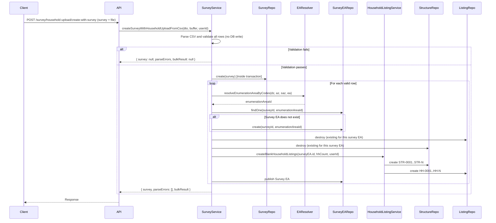

# Create Survey with Household Upload (Process B)

Dedicated documentation for **Create Survey with Household Upload**: create a new survey and upload a CSV of sampled enumeration areas (EAs) with household counts. The system creates the survey, then for each CSV row creates a Survey Enumeration Area and dummy structures plus household listings.

---

## Table of Contents

1. [Overview](#overview)
2. [Workflow Diagram](#workflow-diagram)
3. [Process Description](#process-description)
4. [Error Handling & Response](#error-handling--response)
5. [CSV Format (HCES 2025 Style)](#csv-format-hces-2025-style)
6. [Excel Template](#excel-template)
7. [API Reference](#api-reference)
8. [Request / Response Examples](#request--response-examples)
9. [Create Blank Household Listings (Internal)](#create-blank-household-listings-internal)

---

## Overview

| Item | Description |
|------|-------------|
| **Purpose** | Create a **new survey** and in the same request upload a CSV that defines **sampled EAs** and their **household count** for that survey. No pre-existing survey IDs in the CSV. |
| **Input** | Survey details (name, description, startDate, endDate, year, etc.) + one CSV file with a single count column (`hhCount`). |
| **Output** | On success: created survey + bulk result. On error: `survey: null`, `parseErrors` with row numbers and reasons, `bulkResult: null`. Nothing is persisted when any validation or processing step fails (full rollback). |
| **Access** | Admin only (JWT + `RolesGuard`). |

**Error behaviour:** If required headers are missing, or any row has a parse/EA error, **no survey is created**. If all rows validate but any step fails during processing, the **entire operation is rolled back** (survey and all created data are removed). The response always includes which rows failed and why.

For each CSV row with valid codes and a positive `hhCount`, the backend:

1. Resolves the **Enumeration Area** by geographic codes (dzongkhag → admin zone → sub-admin zone → EA).
2. Finds or creates a **Survey Enumeration Area** linking the new survey to that EA.
3. Replaces any existing household listings and structures for that Survey EA (if present).
4. Creates **dummy structures** and **household listings** for that EA: one structure + one listing per household count (e.g. 43 households → 43 structures + 43 listings).
5. Marks the Survey EA as **published**.

---

## Workflow Diagram

```mermaid
flowchart TB
  Start[Client: survey details + CSV file] --> ParseCSV[Parse CSV: headers + rows]
  ParseCSV --> Validate[Validate: headers, codes, EA resolution, hhCount]
  Validate --> AnyErrors{Any parse errors?}
  AnyErrors -->|Yes| ReturnErrors[Return survey: null, parseErrors, bulkResult: null]
  AnyErrors -->|No| Tx[Begin transaction]
  Tx --> CreateSurvey[Create Survey]
  CreateSurvey --> Loop[For each row]
  Loop --> FindCreateSEA[Find or Create SurveyEnumerationArea]
  FindCreateSEA --> Replace[Replace existing listings/structures]
  Replace --> CreateBlank[Create Blank Household Listings]
  CreateBlank --> Publish[Publish Survey EA]
  Publish --> More{More rows?}
  More -->|Yes| Loop
  More -->|No| Commit[Commit transaction]
  Commit --> Success[Return survey, parseErrors: [], bulkResult]
  Loop --> Fail{Failure?}
  Fail -->|Yes| Rollback[Rollback transaction]
  Rollback --> ReturnFail[Return survey: null, parseErrors: failed row, bulkResult: null]
```



---

## Process Description

### Step 1: Accept input

- **Survey payload** (same fields as `CreateSurveyDto`):
  - **Required:** `name`, `description`, `startDate`, `endDate`, `year`
  - **Optional:** `status`, `isSubmitted`, `isVerified`
  - Do **not** send `enumerationAreaIds`; EAs are taken from the CSV.
- **CSV file** (multipart form field name: `file`). Max size: 10 MB. Allowed types: CSV (e.g. `text/csv`, `.csv`).

### Step 2: Validate CSV (no survey created yet)

- **Delimiter:** Comma or tab (auto-detected from the first line).
- **Headers:** Case-insensitive. Required columns (with HCES-style alternatives):
  - `dzongkhagCode` (required)
  - `adminZoneCode` **or** `gewog/thromde code`
  - `subAdminZoneCode` **or** `chiwogLapCode`
  - `eaCode` (required)
  - `hhCount` (required; must be present and > 0 for each data row)
- If any required header is missing → return `survey: null`, `parseErrors: [{ row: 1, reason: "Missing required headers: ..." }]`, `bulkResult: null`. **Nothing is created.**
- For each data row: validate required codes and `hhCount`, resolve EA by codes. Any failure (missing field, EA not found, invalid/zero hhCount) is added to `parseErrors` with that row number.
- If **any** parse error exists, or no valid rows remain → return `survey: null`, `parseErrors`, `bulkResult: null`. **No survey is created.**

### Step 3: Create survey and process (inside a transaction)

- Only if **all** rows validated successfully, a single database transaction is started.
- The survey is created, then for each row: find/create Survey EA, replace existing listings/structures, create blank household listings, publish Survey EA.
- If **any** step throws (e.g. DB constraint, create failure), the transaction is **rolled back**: the survey and all created Survey EAs, structures, and listings are removed. Response: `survey: null`, `parseErrors: [{ row: <failed row>, reason }]`, `bulkResult: null`.

### Step 4: For each valid row (inside transaction)

- **Resolve EA:** `resolveEnumerationAreaByCodes(dzCode, azCode, sazCode, eaCode)`.
- **Find or create Survey Enumeration Area** for `(survey.id, enumerationAreaId)`.
- **Replace** existing household listings and their structures for this Survey EA (if any).
- **Create blank household listings:** `createBlankHouseholdListings(surveyEA.id, { count: hhCount, remarks: '...' }, userId)`.
  - For each of `hhCount` households: one **Structure** (e.g. STR-0001, STR-0002, …) and one **Household Listing** (e.g. HH-0001, HH-0002, …) with placeholder data.
- **Publish** the Survey EA (`isPublished`, `publishedBy`, `publishedDate`).

### Step 5: Response

- **survey:** The created survey object, or `null` if validation failed or the transaction was rolled back.
- **parseErrors:** Array of `{ row: number, reason: string }`. Empty on full success. When `survey` is `null`, this lists every validation error (with row numbers) or the failed row and reason after rollback.
- **bulkResult:** `BulkHouseholdUploadResponseDto` (totalItems, created, skipped, householdListingsCreated, errors) on success, or `null` when `survey` is `null`.

---

## Error Handling & Response

### Response shape

Every response is JSON with these three fields:

| Field         | Type    | Description |
|---------------|---------|-------------|
| `survey`      | `object \| null` | The created survey when the full flow succeeded; `null` when validation failed or the transaction was rolled back. |
| `parseErrors` | `array` | List of `{ row: number, reason: string }`. Empty when everything succeeded. |
| `bulkResult`  | `object \| null` | Summary of created Survey EAs and household listings when successful; `null` when `survey` is `null`. |

### When is nothing created (survey = null)?

1. **Missing or invalid CSV structure**
   - CSV has no header or no data rows.
   - Required headers are missing (see [CSV Format](#csv-format-hces-2025-style)).
2. **Any row fails validation**
   - Missing one of: dzongkhagCode, adminZoneCode (or gewog/thromde code), subAdminZoneCode (or chiwogLapCode), eaCode, or hhCount.
   - EA cannot be resolved for the given codes.
   - hhCount is missing, not a number, negative, or zero.
3. **Processing failure after validation**
   - All rows validated, but a database step failed (e.g. create Survey EA, create structures/listings). The whole transaction is rolled back; the survey and all related data are removed.

In all these cases the response has `survey: null`, `parseErrors` populated (with row numbers and reasons), and `bulkResult: null`.

### Parse error messages (reason)

| Reason (example) | Meaning |
|------------------|--------|
| `CSV must include header and at least one data row` | File is empty or has only a header (row 1). |
| `Missing required headers: dzongkhagCode, hhCount` | One or more required column names are missing (reported on row 1). |
| `Missing one of dzongkhagCode/adminZoneCode/subAdminZoneCode/eaCode` | That data row is missing at least one of the code columns. |
| `Missing hhCount` | That row has no value (or empty) for the hhCount column. |
| `Enumeration area not found for codes dzongkhag=X, admin=Y, subAdmin=Z, ea=W` | No EA in the database matches the code chain for that row. |
| `Invalid hhCount value: <value>` | hhCount is not a valid number for that row. |
| `hhCount must be greater than 0` | hhCount is 0 for that row. |
| `No valid items found in CSV (hhCount must be > 0 for at least one row)` | Every row was skipped (e.g. missing hhCount or zero); no row to process (row 0 in parseErrors). |
| `Row <N>: <message>` | A processing error occurred while handling CSV row N (transaction rolled back). `<message>` is the underlying error (e.g. DB constraint, server error). |

### Example responses

**Success (200):**

```json
{
  "survey": {
    "id": 1,
    "name": "HCES 2025",
    "description": "Household Consumption and Expenditure Survey 2025",
    "startDate": "2025-01-01",
    "endDate": "2025-12-31",
    "year": 2025,
    "status": "ACTIVE"
  },
  "parseErrors": [],
  "bulkResult": {
    "totalItems": 441,
    "created": 441,
    "skipped": 0,
    "householdListingsCreated": 25000,
    "errors": []
  }
}
```

**Validation failure – missing headers (200, nothing created):**

```json
{
  "survey": null,
  "parseErrors": [
    {
      "row": 1,
      "reason": "Missing required headers: hhCount"
    }
  ],
  "bulkResult": null
}
```

**Validation failure – EA not found (200, nothing created):**

```json
{
  "survey": null,
  "parseErrors": [
    {
      "row": 5,
      "reason": "Enumeration area not found for codes dzongkhag=1, admin=1, subAdmin=99, ea=1"
    }
  ],
  "bulkResult": null
}
```

**Validation failure – multiple rows (200, nothing created):**

```json
{
  "survey": null,
  "parseErrors": [
    { "row": 3, "reason": "Missing hhCount" },
    { "row": 7, "reason": "Invalid hhCount value: abc" },
    { "row": 12, "reason": "hhCount must be greater than 0" }
  ],
  "bulkResult": null
}
```

**Processing failure – transaction rolled back (200, nothing persisted):**

```json
{
  "survey": null,
  "parseErrors": [
    {
      "row": 42,
      "reason": "Row 42: Survey enumeration area with ID 123 not found"
    }
  ],
  "bulkResult": null
}
```

**No valid rows (200, nothing created):**

```json
{
  "survey": null,
  "parseErrors": [
    {
      "row": 0,
      "reason": "No valid items found in CSV (hhCount must be > 0 for at least one row)"
    }
  ],
  "bulkResult": null
}
```

---

## CSV Format (HCES 2025 Style)

Headers (order can vary; matching is case-insensitive and supports the names below):

| Header (example)       | Required | Description |
|------------------------|----------|-------------|
| Dzongkhag              | No       | Name (informational). |
| dzongkhagCode          | Yes      | Dzongkhag code. |
| gewog/thromde          | No       | Name (informational). |
| gewog/thromde code     | Yes      | Administrative zone code. (Backend maps to adminZoneCode.) |
| chiwog/lap             | No       | Name (informational). |
| chiwogLapCode          | Yes      | Sub-administrative zone code. (Backend maps to subAdminZoneCode.) |
| eaCode                 | Yes      | Enumeration area code. |
| EA Description         | No       | Informational. |
| hhCount                | Yes      | Household count for this EA in the new survey. Must be a non-negative number; rows with 0 or empty are skipped. |

**Example CSV (comma-separated):**

```text
Dzongkhag,dzongkhagCode,gewog/thromde,gewog/thromde code,chiwog/lap,chiwogLapCode,eaCode,EA Description,hhCount
Bumthang,1,Chhoekhor,1,Dawathang_Dorjibi_ Kashingtsawa,1,1,from dorjibi till pangri village,43
Bumthang,1,Chhoekhor,1,Dawathang_Dorjibi_ Kashingtsawa,1,6,from lamai goenpa to lamaithang till jakar school campus.,57
```

- EA is resolved by the chain: **dzongkhagCode** → **adminZoneCode** (gewog/thromde code) → **subAdminZoneCode** (chiwogLapCode) → **eaCode**.

---

## Excel Template

A downloadable Excel template provides the correct headers for the CSV used in this process.

| Method | Route | Access | Description |
|--------|--------|--------|-------------|
| GET | `/survey/household-upload/template/excel` | Admin | Download an Excel (.xlsx) file with the HCES-style headers and no data rows. |

**Template columns:**

- Dzongkhag  
- dzongkhagCode  
- gewog/thromde  
- gewog/thromde code  
- chiwog/lap  
- chiwogLapCode  
- eaCode  
- EA Description  
- hhCount  

Use the template to fill data, then export or save as CSV (keeping the same headers) for `POST /survey/household-upload/create-with-survey`.

---

## API Reference

| Method | Route | Access | Description |
|--------|--------|--------|-------------|
| GET  | `/survey/household-upload/template/excel` | Admin | Download Excel template for the household upload CSV. |
| POST | `/survey/household-upload/create-with-survey` | Admin | Create survey and upload CSV; create Survey EAs and dummy structures/listings per row. |

### POST /survey/household-upload/create-with-survey

- **Content-Type:** `multipart/form-data`
- **Form fields:**
  - **Survey (text fields):** `name`, `description`, `startDate`, `endDate`, `year`; optional: `status`, `isSubmitted`, `isVerified`
  - **file:** CSV file (headers as in [CSV Format](#csv-format-hces-2025-style))
- **Response:** JSON  
  `{ survey, parseErrors, bulkResult }`  
  - `survey`: created survey  
  - `parseErrors`: `{ row, reason }[]`  
  - `bulkResult`: `BulkHouseholdUploadResponseDto` or `null`

### GET /survey/household-upload/template/excel

- **Response:** Binary `.xlsx` file with header row only (no data rows).

---

## Request / Response Examples

### Create survey + upload CSV

**Request (multipart/form-data):**

- `name`: `HCES 2025`
- `description`: `Household Consumption and Expenditure Survey 2025`
- `startDate`: `2025-01-01`
- `endDate`: `2025-12-31`
- `year`: `2025`
- `file`: (CSV file with headers and data rows as above)

**Response (success, no parse errors):**

```json
{
  "survey": {
    "id": 1,
    "name": "HCES 2025",
    "description": "Household Consumption and Expenditure Survey 2025",
    "startDate": "2025-01-01",
    "endDate": "2025-12-31",
    "year": 2025,
    "status": "ACTIVE"
  },
  "parseErrors": [],
  "bulkResult": {
    "totalItems": 441,
    "created": 441,
    "skipped": 0,
    "householdListingsCreated": 25000,
    "errors": []
  }
}
```

**Response when validation fails (survey not created; see [Error Handling & Response](#error-handling--response) for more examples):**

```json
{
  "survey": null,
  "parseErrors": [
    { "row": 5, "reason": "Enumeration area not found for codes dzongkhag=1, admin=1, subAdmin=99, ea=1" }
  ],
  "bulkResult": null
}
```

**Response when processing fails (transaction rolled back):**

```json
{
  "survey": null,
  "parseErrors": [
    { "row": 42, "reason": "Row 42: <underlying error message>" }
  ],
  "bulkResult": null
}
```

---

## Create Blank Household Listings (Internal)

Process B uses the same internal subprocess as the existing bulk household upload:

- **Service:** `SurveyEnumerationAreaHouseholdListingService.createBlankHouseholdListings(surveyEnumerationAreaId, dto, userId)`
- **DTO:** `{ count: number, remarks?: string }`

For each of `count`:

1. Create one **Structure:** `structureNumber` = STR-0001, STR-0002, …; `latitude`/`longitude` = null.
2. Create one **Household Listing:** linked to that structure and the Survey EA; `householdIdentification` = HH-0001, HH-0002, …; placeholder values (e.g. nameOfHOH = 'Not Available', totals = 0); `submittedBy` = userId.

So **one household count** in the CSV produces **one dummy structure** and **one dummy household listing** for that Survey EA.
