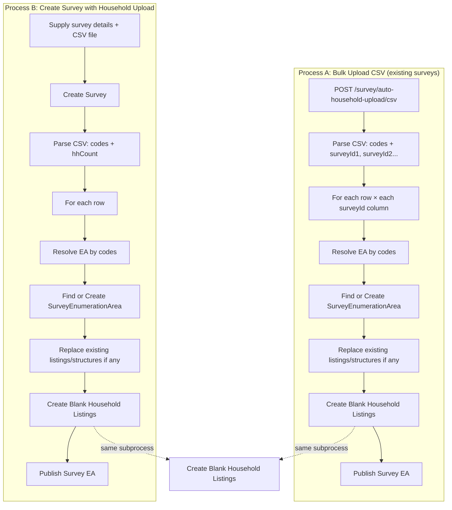
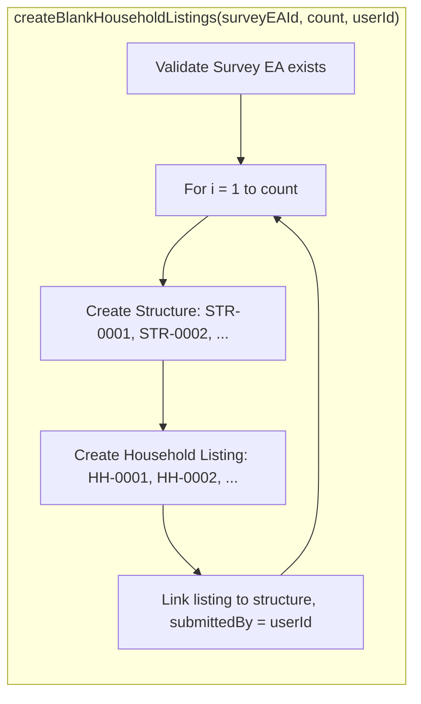
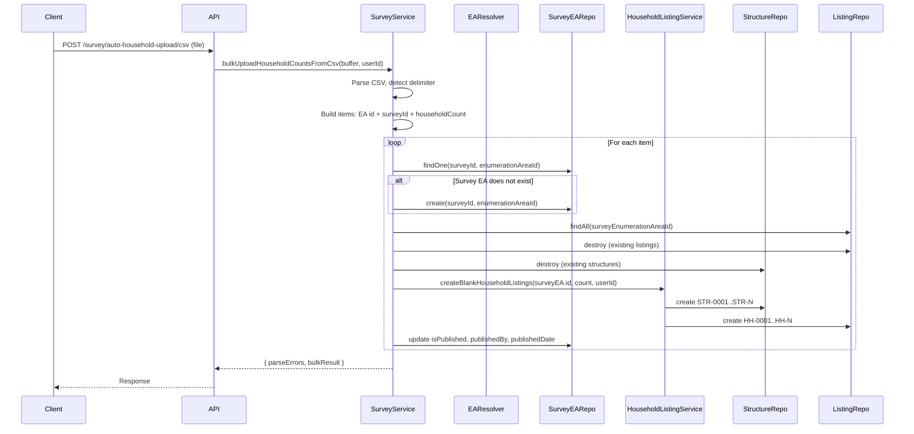
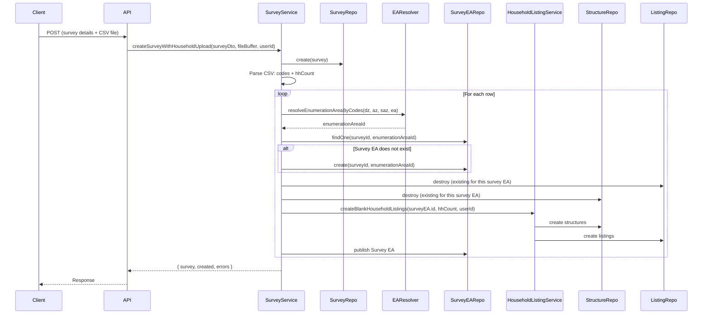
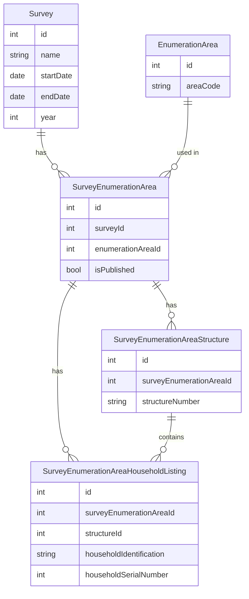

# Survey & Household Upload Workflows

This document describes the two household-upload flows: **Bulk Upload CSV (existing surveys)** and **Create Survey with Household Upload (survey-first + CSV)**. It includes workflow diagrams and full process descriptions.

---

## Table of Contents

1. [Overview](#overview)
2. [Workflow Diagram (Mermaid)](#workflow-diagram-mermaid)
3. [Process A: Bulk Upload Household Counts CSV](#process-a-bulk-upload-household-counts-csv)
4. [Process B: Create Survey with Household Upload](#process-b-create-survey-with-household-upload)
5. [Shared Subprocess: Create Blank Household Listings](#shared-subprocess-create-blank-household-listings)
6. [CSV Formats](#csv-formats)
7. [Entity Relationships](#entity-relationships)
8. [API Reference](#api-reference)

---

## Overview

| Process | Description | When to use |
|--------|-------------|-------------|
| **A. Bulk Upload CSV** | Upload a CSV that maps EAs (by geographic codes) to **existing** survey IDs and household counts. Creates/updates Survey Enumeration Areas and dummy structures + household listings per count. | Surveys already exist; you are adding or replacing EA-level household counts for those surveys. |
| **B. Create Survey with Upload** | Provide survey details (name, description, dates, year) and a CSV of sampled EAs with a single `hhCount` column. Creates the survey first, then for each row creates Survey EA + dummy structures and household listings. | You are defining a new survey and its sampled EAs and household counts in one step. |

Both processes use the same EA resolution (by dzongkhag/admin/subAdmin/ea codes), the same **Create Survey Enumeration Area** step, and the same **Create Blank Household Listings** subprocess (one dummy structure + one household listing per count).

---

## Workflow Diagram (Mermaid)

### High-level: Both processes



### Detailed: Create Blank Household Listings (shared)



### Sequence: Process A (Bulk Upload CSV)



### Sequence: Process B (Create Survey with Household Upload)



---

## Process A: Bulk Upload Household Counts CSV

### Description

- **Route:** `POST /survey/auto-household-upload/csv`
- **Access:** Admin only (JWT + RolesGuard).
- **Input:** Multipart form with `file`: CSV (tab or comma separated).
- **Assumption:** Surveys referenced in the CSV (via columns like `surveyId1`, `surveyId2`) **must already exist**.

### Steps

1. **Parse CSV**
   - Detect delimiter (tab if first line contains tab, else comma).
   - Required headers (case-insensitive): `dzongkhagCode`, `adminZoneCode`, `subAdminZoneCode`, `eaCode`.
   - Any column whose header **starts with** `surveyId` (e.g. `surveyId1`, `surveyId2`) is treated as a survey ID; the cell value is the household count for that survey.

2. **Build items**
   - For each data row, resolve EA by codes via `resolveEnumerationAreaByCodes(dzCode, azCode, sazCode, eaCode)`.
   - For each (row, surveyId column) with a valid numeric count > 0, add an item: `{ enumerationAreaId, surveyId, householdCount }`.

3. **Validation**
   - If any row has missing codes or EA resolution fails, parse errors are collected. If there are any parse errors, the **entire upload is rejected** (no DB writes).
   - If no valid items remain (e.g. all counts 0 or missing), upload is rejected.

4. **Bulk upload**
   - Call `bulkUploadHouseholdCounts({ items }, userId)`.
   - For each item:
     - Validate EA and survey exist (active EA, existing survey).
     - Find or create **SurveyEnumerationArea** for `(surveyId, enumerationAreaId)`.
     - **Replace** existing data: delete existing household listings and their structures for that Survey EA.
     - Call **createBlankHouseholdListings**(surveyEA.id, { count: householdCount, remarks: 'Auto-uploaded household data' }, userId).
     - Mark the Survey EA as **published** (isPublished, publishedBy, publishedDate).

5. **Response**
   - `parseErrors`: list of { row, reason } (if any; upload is still rejected when parseErrors.length > 0).
   - `bulkResult`: summary (totalItems, created, skipped, householdListingsCreated, errors per item).

### CSV format (Process A)

| Header (example)     | Required | Description |
|----------------------|----------|-------------|
| dzongkhagCode        | Yes      | Dzongkhag code (e.g. 1, 2). |
| adminZoneCode        | Yes      | Administrative zone (Gewog/Thromde) code. |
| subAdminZoneCode     | Yes      | Sub-administrative zone (Chiwog/LAP) code. |
| eaCode               | Yes      | Enumeration area code. |
| surveyId1, surveyId2… | At least one | Column name must start with `surveyId`; value = household count for that survey ID. |

- EA is resolved by the chain: dzongkhagCode → adminZoneCode → subAdminZoneCode → eaCode.
- Rows with missing codes or unresolved EA are reported in `parseErrors` and cause full rejection.

---

## Process B: Create Survey with Household Upload

### Description

- **Purpose:** Create a **new survey** and in the same request upload a CSV that defines **sampled EAs** and their **household count** for that survey. No pre-existing survey IDs in the CSV.
- **Input:** Survey details (name, description, startDate, endDate, year, etc.) + one CSV file with a single count column (e.g. `hhCount`).
- **Typical CSV:** Same geographic code columns as Process A, plus one column for household count (e.g. `hhCount`), as in HCES 2025-style files.

### Steps

1. **Accept input**
   - Survey payload (e.g. name, description, startDate, endDate, year; optional status, isSubmitted, isVerified). Do **not** pass `enumerationAreaIds`; EAs come from the CSV.
   - CSV file (multipart or equivalent).

2. **Create survey**
   - Create survey via `surveyService.create(surveyPayload)` (or equivalent). This creates the survey only; no EA associations yet.

3. **Parse CSV**
   - Same delimiter and trimming rules as Process A.
   - Required columns: geographic codes (dzongkhag, admin zone, sub-admin zone, EA). Map header names to codes (e.g. `gewog/thromde code` → adminZoneCode, `chiwogLapCode` → subAdminZoneCode).
   - One count column: e.g. `hhCount` (or configurable name). Single survey = single count per row.

4. **For each CSV row**
   - Resolve EA by codes (same resolver as Process A).
   - Find or create **SurveyEnumerationArea** for `(newSurvey.id, enumerationAreaId)`.
   - Optionally **replace** existing listings/structures for this Survey EA (same as Process A).
   - Call **createBlankHouseholdListings**(surveyEA.id, { count: hhCount, remarks: '...' }, userId).
   - Optionally **publish** the Survey EA.

5. **Response**
   - Created survey + summary (e.g. rows processed, Survey EAs created, household listings/structures created, parse/row errors).

### CSV format (Process B) – e.g. HCES 2025

| Header (example)       | Required | Description |
|------------------------|----------|-------------|
| Dzongkhag              | No       | Name (informational). |
| dzongkhagCode          | Yes      | Dzongkhag code. |
| gewog/thromde          | No       | Name (informational). |
| gewog/thromde code     | Yes      | Administrative zone code. |
| chiwog/lap             | No       | Name (informational). |
| chiwogLapCode          | Yes      | Sub-administrative zone code. |
| eaCode                 | Yes      | Enumeration area code. |
| EA Description         | No       | Informational. |
| hhCount                | Yes      | Household count for this EA in the new survey. |

- Backend must map: `gewog/thromde code` → adminZoneCode, `chiwogLapCode` → subAdminZoneCode (normalize header names for lookup).

---

## Shared Subprocess: Create Blank Household Listings

### Description

- **Service:** `SurveyEnumerationAreaHouseholdListingService.createBlankHouseholdListings(surveyEnumerationAreaId, dto, userId)`.
- **DTO:** `{ count: number, remarks?: string }`.
- **Used by:** Both Process A and Process B after ensuring a SurveyEnumerationArea exists.

### Steps

1. **Validate**
   - Load Survey Enumeration Area by ID; throw if not found.

2. **For each of `count` households**
   - Create one **Structure**: `structureNumber` = `STR-0001`, `STR-0002`, … (pad to 4 digits); `latitude`/`longitude` = null.
   - Create one **Household Listing**:
     - Linked to that structure and to the Survey EA.
     - `householdIdentification` = `HH-0001`, `HH-0002`, …
     - `householdSerialNumber` = 1 per structure (here, one household per structure).
     - `nameOfHOH` = `'Not Available'`, `totalMale`/`totalFemale` = 0, `phoneNumber` = null.
     - `remarks` = dto.remarks or default (e.g. `'No data available - Historical survey entry'`).
     - `submittedBy` = userId.

3. **Return**
   - `{ success, message, created: count, listings }`.

### Effect

- **One household count** → **one dummy structure** + **one dummy household listing**.
- All created listings are linked to the same Survey Enumeration Area and to the newly created structures.

---

## CSV Formats

### Process A (existing surveys)

```text
dzongkhag,dzongkhagCode,adminZone,adminZoneCode,subAdminZone,subAdminZoneCode,ea,eaCode,surveyId1,surveyId2
Bumthang,1,Chhoekhor,1,Dawathang,1,1,1,43,50
```

- Multiple survey columns: `surveyId1`, `surveyId2`, … (survey IDs must exist).

### Process B (create survey + upload) – HCES 2025 style

```text
Dzongkhag,dzongkhagCode,gewog/thromde,gewog/thromde code,chiwog/lap,chiwogLapCode,eaCode,EA Description,hhCount
Bumthang,1,Chhoekhor,1,Dawathang_Dorjibi_ Kashingtsawa,1,1,from dorjibi till pangri village,43
```

- Single count column: `hhCount` for the survey being created.

---

## Entity Relationships



- **Survey**: name, description, startDate, endDate, year, status.
- **SurveyEnumerationArea**: links a survey to an enumeration area; can be published.
- **SurveyEnumerationAreaStructure**: dummy structure (e.g. STR-0001) per household in blank uploads.
- **SurveyEnumerationAreaHouseholdListing**: one per household; links to structure; in blank uploads has placeholder data (e.g. nameOfHOH = 'Not Available', counts = 0).

---

## API Reference

### Process A (implemented)

| Method | Route | Access | Description |
|--------|--------|--------|-------------|
| POST   | `/survey/auto-household-upload/csv` | Admin | Bulk upload household counts via CSV. Body: multipart `file` (CSV). Surveys must exist. |

### Process B (implemented)

| Method | Route | Access | Description |
|--------|--------|--------|-------------|
| POST   | `/survey/household-upload/create-with-survey` | Admin | Create survey from body (survey details) + multipart CSV (HCES-style) and create Survey EAs and dummy structures/listings per row. |
| GET    | `/survey/household-upload/template/excel` | Admin | Download Excel template (.xlsx) for the HCES-style household upload CSV (Process B). |

### Create Blank Household Listings (internal / direct API)

| Method | Route | Access | Description |
|--------|--------|--------|-------------|
| POST   | `…/survey-enumeration-area/:surveyEnumerationAreaId/household-listings/blank` | As per your controller | Create `count` dummy structures and household listings for the given Survey EA. |

---

## Summary

- **Process A** updates **existing** surveys with EA-level household counts from a CSV (multiple surveyId columns).
- **Process B** creates a **new** survey and, from one CSV with a single count column (e.g. `hhCount`), creates Survey EAs and the same dummy structures and household listings.
- Both rely on **EA resolution by geographic codes** and the shared **createBlankHouseholdListings** subprocess (one structure + one listing per household count).

The Mermaid diagrams above can be rendered in any Markdown viewer that supports Mermaid (e.g. GitHub, GitLab, VS Code with a Mermaid extension).
