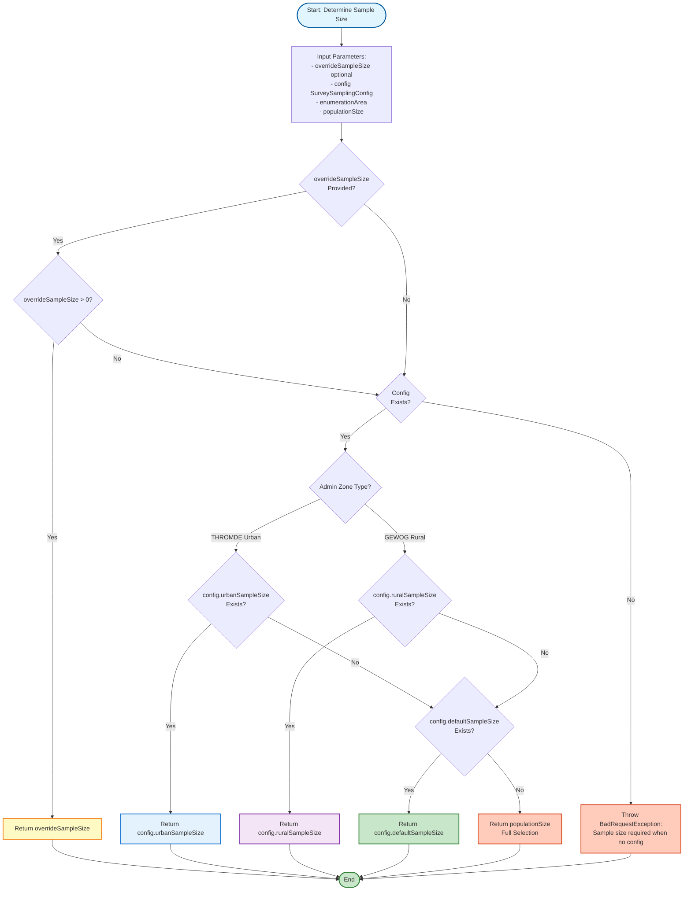
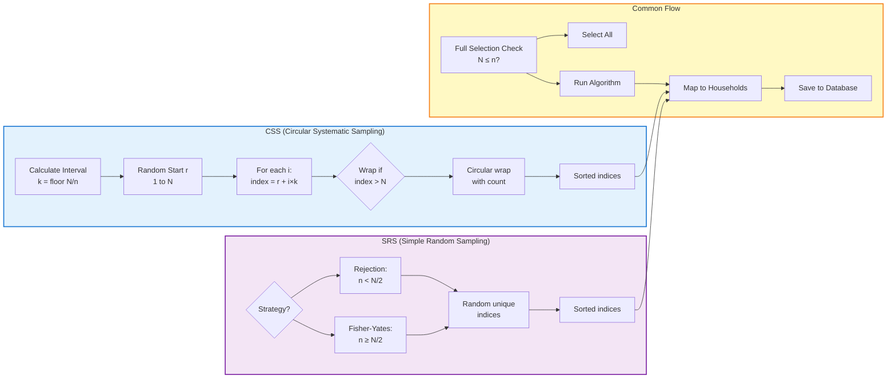

# Sampling Logic Flowchart (CSS & SRS)

This document contains Mermaid.js flowcharts that visualize the complete logic flow for Circular Systematic Sampling (CSS) and Simple Random Sampling (SRS) as implemented in the sampling service.

## Table of Contents

1. [Main Sampling Flow](#main-sampling-flow)
2. [CSS Algorithm Flow](#css-algorithm-flow)
3. [SRS Algorithm Flow](#srs-algorithm-flow)
4. [Sample Size Determination](#sample-size-determination)

---

## Main Sampling Flow

```mermaid
flowchart TD
    Start([Start: Run Sampling for Enumeration Area]) --> ValidateSurvey[Validate Survey Exists]
    ValidateSurvey --> GetSurveyEA[Get Survey Enumeration Area<br/>with Location Hierarchy]
    GetSurveyEA --> CheckEA{Survey EA<br/>Found?}
    CheckEA -->|No| Error1[Throw NotFoundException]
    CheckEA -->|Yes| GetHouseholds[Fetch Household Listings<br/>Ordered by Serial Number]
    
    GetHouseholds --> CheckHouseholds{Households<br/>Exist?}
    CheckHouseholds -->|No| Error2[Throw BadRequestException:<br/>No household listings found]
    CheckHouseholds -->|Yes| GetConfig[Get Survey Sampling Config]
    
    GetConfig --> CalculateParams[Calculate Parameters:<br/>- Population Size N<br/>- Method CSS/SRS<br/>- Sample Size n]
    
    CalculateParams --> CheckExisting{Sampling<br/>Already Exists?}
    CheckExisting -->|Yes| CheckOverwrite{Overwrite<br/>Requested?}
    CheckOverwrite -->|No| Error3[Throw BadRequestException:<br/>Sampling exists, set overwriteExisting=true]
    CheckOverwrite -->|Yes| DeleteExisting[Delete Existing:<br/>- Household Samples<br/>- Sampling Record]
    DeleteExisting --> CheckFullSelection
    CheckExisting -->|No| CheckFullSelection{Population Size N<br/>≤ Sample Size n?}
    
    CheckFullSelection -->|Yes| FullSelection[Full Selection Mode:<br/>Select ALL households<br/>Set isFullSelection=true]
    CheckFullSelection -->|No| CheckMethod{Method?}
    
    CheckMethod -->|CSS| RunCSS[Run CSS Algorithm]
    CheckMethod -->|SRS| RunSRS[Run SRS Algorithm]
    
    RunCSS --> MapIndices
    RunSRS --> MapIndices
    FullSelection --> MapIndices[Map Indices to Households:<br/>indices.map → households[index-1]]
    
    MapIndices --> CreateSamplingRecord[Create Sampling Record:<br/>- Store method, sizes<br/>- Store indices, metadata<br/>- Store CSS params if applicable]
    
    CreateSamplingRecord --> CreateSamples[Create Household Sample Records:<br/>- Link to sampling<br/>- Set selection order<br/>- Mark as not replacement]
    
    CreateSamples --> ReturnSuccess[Return Success Response:<br/>- Sampling ID<br/>- Method, sizes<br/>- Execution timestamp]
    
    ReturnSuccess --> End([End])
    Error1 --> End
    Error2 --> End
    Error3 --> End
    
    style Start fill:#e1f5ff,stroke:#01579b,stroke-width:2px
    style End fill:#c8e6c9,stroke:#2e7d32,stroke-width:2px
    style Error1 fill:#ffccbc,stroke:#d84315,stroke-width:2px
    style Error2 fill:#ffccbc,stroke:#d84315,stroke-width:2px
    style Error3 fill:#ffccbc,stroke:#d84315,stroke-width:2px
    style FullSelection fill:#fff9c4,stroke:#f57f17,stroke-width:2px
    style RunCSS fill:#e3f2fd,stroke:#1976d2,stroke-width:2px
    style RunSRS fill:#f3e5f5,stroke:#7b1fa2,stroke-width:2px
```

---

## CSS Algorithm Flow

```mermaid
flowchart TD
    Start([Start: CSS Sampling]) --> Input[Input Parameters:<br/>- Population Size N<br/>- Sample Size n<br/>- Optional Random Start r]
    
    Input --> CalculateInterval[Calculate Sampling Interval:<br/>k = floor N / n<br/>If k ≤ 0, set k = 1]
    
    CalculateInterval --> CheckRandomStart{Random Start<br/>Provided?}
    CheckRandomStart -->|Yes| ValidateStart{1 ≤ r ≤ N?}
    ValidateStart -->|No| Error1[Throw BadRequestException:<br/>Random start out of range]
    ValidateStart -->|Yes| UseProvided[Use Provided Random Start r]
    CheckRandomStart -->|No| GenerateRandom[Generate Random Start:<br/>r = randomInt 1 to N]
    
    UseProvided --> Initialize
    GenerateRandom --> Initialize[Initialize:<br/>- indices = []<br/>- wrapAroundCount = 0<br/>- start = r]
    
    Initialize --> LoopStart{For i = 0 to n-1}
    LoopStart -->|Continue| CalculateIndex[Calculate Index:<br/>index = start + i × k]
    
    CalculateIndex --> CheckWrap{index > N?}
    CheckWrap -->|Yes| WrapAround[index -= N<br/>wrapAroundCount++]
    WrapAround --> CheckWrap
    CheckWrap -->|No| AddIndex[indices.push index]
    
    AddIndex --> LoopStart
    LoopStart -->|Done| SortIndices[Sort Indices Ascending]
    
    SortIndices --> BuildMetadata[Build Metadata:<br/>- method: CSS<br/>- samplingInterval: k<br/>- randomStart: r<br/>- wrapAroundCount]
    
    BuildMetadata --> ReturnResult[Return SamplingResult:<br/>- indices array<br/>- samplingInterval<br/>- randomStart<br/>- wrapAroundCount<br/>- metadata]
    
    ReturnResult --> End([End])
    Error1 --> End
    
    style Start fill:#e1f5ff,stroke:#01579b,stroke-width:2px
    style End fill:#c8e6c9,stroke:#2e7d32,stroke-width:2px
    style Error1 fill:#ffccbc,stroke:#d84315,stroke-width:2px
    style CalculateInterval fill:#fff9c4,stroke:#f57f17,stroke-width:2px
    style WrapAround fill:#ffccbc,stroke:#d84315,stroke-width:2px
    style ReturnResult fill:#c8e6c9,stroke:#2e7d32,stroke-width:2px
```

---

## SRS Algorithm Flow

```mermaid
flowchart TD
    Start([Start: SRS Sampling]) --> Input[Input Parameters:<br/>- Population Size N<br/>- Sample Size n]
    
    Input --> Initialize[Initialize:<br/>- indices = Set<br/>- metadata.method = SRS]
    
    Initialize --> CheckStrategy{n < N/2?}
    
    CheckStrategy -->|Yes| RejectionSampling[Rejection Sampling Strategy]
    CheckStrategy -->|No| FisherYates[Partial Fisher-Yates Shuffle]
    
    RejectionSampling --> SetStrategy1[metadata.strategy = 'rejection-sampling']
    SetStrategy1 --> RejectionLoop{indices.size<br/>< n?}
    RejectionLoop -->|Yes| GenerateRandom[Generate Random Index:<br/>idx = randomInt 1 to N]
    GenerateRandom --> AddToSet[indices.add idx]
    AddToSet --> RejectionLoop
    RejectionLoop -->|No| SortIndices
    
    FisherYates --> SetStrategy2[metadata.strategy = 'partial-fisher-yates']
    SetStrategy2 --> CreateArray[Create Array:<br/>allIndices = [1, 2, ..., N]]
    
    CreateArray --> ShuffleLoop{For i = 0 to n-1}
    ShuffleLoop -->|Continue| GenerateJ[j = randomInt i to N-1]
    GenerateJ --> Swap[Swap allIndices[i] with allIndices[j]]
    Swap --> ShuffleLoop
    ShuffleLoop -->|Done| ExtractFirst[Extract First n Items:<br/>indices.add allIndices[0..n-1]]
    
    ExtractFirst --> SortIndices[Sort Indices Ascending]
    RejectionLoop --> SortIndices
    
    SortIndices --> BuildMetadata[Build Metadata:<br/>- method: SRS<br/>- strategy: rejection-sampling OR partial-fisher-yates]
    
    BuildMetadata --> ReturnResult[Return SamplingResult:<br/>- sorted indices array<br/>- metadata]
    
    ReturnResult --> End([End])
    
    style Start fill:#e1f5ff,stroke:#01579b,stroke-width:2px
    style End fill:#c8e6c9,stroke:#2e7d32,stroke-width:2px
    style RejectionSampling fill:#e3f2fd,stroke:#1976d2,stroke-width:2px
    style FisherYates fill:#f3e5f5,stroke:#7b1fa2,stroke-width:2px
    style ReturnResult fill:#c8e6c9,stroke:#2e7d32,stroke-width:2px
```

---

## Sample Size Determination



---

## Combined Algorithm Comparison



---

## Key Implementation Details

### CSS Algorithm
- **Interval Calculation**: `k = Math.floor(N / n)` (minimum 1)
- **Random Start**: Validated to be between 1 and N
- **Circular Wrapping**: When `index > N`, subtract N repeatedly until `index ≤ N`
- **Wrap Count**: Tracks how many times wrapping occurred (diagnostic)
- **Indices**: 1-based positions matching household serial numbers

### SRS Algorithm
- **Strategy Selection**: 
  - `n < N/2`: Rejection sampling (faster, low collision probability)
  - `n ≥ N/2`: Partial Fisher-Yates shuffle (avoids repeated collisions)
- **Rejection Sampling**: Keep drawing random integers until `n` unique values collected
- **Fisher-Yates**: Shuffle only first `n` positions of array [1..N]
- **Sorting**: Final indices are sorted for readability and consistency

### Full Selection
- When `populationSize ≤ sampleSize`, all households are selected
- `isFullSelection = true` flag is set
- No algorithm is run (short-circuit)

### Data Persistence
- **SurveyEnumerationAreaSampling**: Stores sampling run metadata
- **SurveyEnumerationAreaHouseholdSample**: Links selected households to sampling run
- **Metadata**: Includes method, strategy, intervals, wrap counts, etc.

---

## Usage Notes

1. **Household Ordering**: CSS assumes households are ordered (typically by route/listing order)
2. **1-Based Indices**: All indices are 1-based to match household serial numbers
3. **Deterministic Option**: CSS can use provided `randomStart` for reproducibility
4. **Performance**: SRS strategy automatically optimizes based on sample size ratio
5. **Validation**: All inputs are validated before algorithm execution

---

## References

- See `CRS_SRS_LOGIC.md` for detailed algorithm explanations
- See `sampling.service.ts` for implementation code
- See `SAMPLING_FRONTEND_GUIDE.md` for API usage

